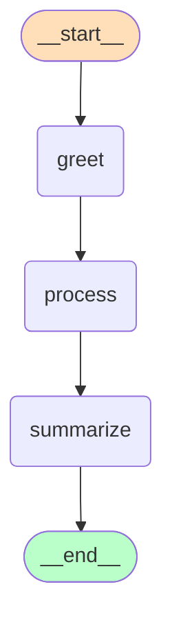

# LangGraph Agent 튜토리얼

LangGraph를 사용하여 AI Agent를 만드는 방법을 기초부터 배우는 튜토리얼입니다.

## 📚 목차

1. [LangGraph란?](#langgraph란)
2. [설치 및 환경 설정](#설치-및-환경-설정)
3. [핵심 개념](#핵심-개념)
4. [예제 코드](#예제-코드)
5. [실행 방법](#실행-방법)
6. [그래프 시각화](#그래프-시각화)
7. [학습 로드맵](#학습-로드맵)

---

## 🤖 LangGraph란?

**LangGraph**는 LangChain에서 만든 라이브러리로, **복잡한 AI Agent를 그래프 구조로 설계**할 수 있게 해줍니다.

### 왜 LangGraph를 사용하나요?

- ✅ **명확한 흐름 제어**: Agent의 동작을 시각적으로 이해하고 설계
- ✅ **상태 관리**: 대화 히스토리, 변수 등을 체계적으로 관리
- ✅ **조건부 분기**: 상황에 따라 다른 동작을 실행
- ✅ **확장 가능**: 복잡한 멀티 에이전트 시스템 구축 가능

### 기본 구조

```
┌─────────┐      ┌─────────┐      ┌─────────┐
│  START  │ ───> │  Node1  │ ───> │  Node2  │ ───> │  END  │
└─────────┘      └─────────┘      └─────────┘
```

- **State**: Agent가 유지하는 데이터
- **Node**: 실행할 함수들
- **Edge**: Node 간의 연결 (흐름)

---

## 🛠 설치 및 환경 설정

### 1. Python 가상환경 생성

```bash
# 가상환경 생성
python -m venv venv

# 활성화 (Mac/Linux)
source venv/bin/activate

# 활성화 (Windows)
venv\Scripts\activate
```

### 2. 패키지 설치

```bash
# 필수 패키지 설치
pip install -r requirements.txt

# 개발 도구 설치 (선택사항)
pip install -r requirements-dev.txt
```

### 3. OpenAI API 키 설정 (LLM 예제용)

```bash
# .env 파일 생성
cp .env.example .env

# .env 파일 편집하여 API 키 입력
# OPENAI_API_KEY=your-actual-api-key-here
```

OpenAI API 키는 [여기서 발급](https://platform.openai.com/api-keys)받을 수 있습니다.

---

## 🧠 핵심 개념

### 1. State (상태)

Agent가 대화 중 유지하는 데이터를 정의합니다.

```python
from typing import TypedDict

class AgentState(TypedDict):
    messages: list      # 대화 메시지
    user_name: str      # 사용자 이름
    step_count: int     # 실행 단계 수
```

### 2. Node (노드)

각 단계에서 실행될 함수입니다.

```python
def greet_user(state: AgentState) -> AgentState:
    """사용자를 환영하는 노드"""
    greeting = f"안녕하세요, {state['user_name']}님!"
    return {"messages": [greeting]}
```

### 3. Graph (그래프)

Node들을 연결하여 전체 흐름을 정의합니다.

```python
from langgraph.graph import StateGraph, START, END

workflow = StateGraph(AgentState)
workflow.add_node("greet", greet_user)
workflow.add_edge(START, "greet")
workflow.add_edge("greet", END)

app = workflow.compile()
```

### 4. Conditional Edge (조건부 분기)

상황에 따라 다른 경로로 분기합니다.

```python
def route_message(state):
    if state["type"] == "greeting":
        return "greeting_handler"
    else:
        return "default_handler"

workflow.add_conditional_edges(
    "classifier",
    route_message,
    {
        "greeting_handler": "greet",
        "default_handler": "default"
    }
)
```

---

## 📝 예제 코드

### 예제 1: 기본 Agent (`src/agents/basic_agent.py`)

가장 간단한 LangGraph Agent입니다.

**특징:**
- State 정의 및 관리
- 순차적인 노드 실행
- 메시지 히스토리 추적

**실행:**
```bash
python src/agents/basic_agent.py
```

**배울 수 있는 것:**
- `StateGraph` 사용법
- `add_node()`, `add_edge()` 기본 사용
- State 업데이트 패턴

---

### 예제 2: 조건부 분기 Agent (`src/agents/conditional_agent.py`)

메시지 타입에 따라 다른 처리를 하는 Agent입니다.

**특징:**
- 메시지 분류 (인사, 질문, 명령, 기타)
- 조건부 라우팅
- 타입별 핸들러

**실행:**
```bash
python src/agents/conditional_agent.py
```

**배울 수 있는 것:**
- `add_conditional_edges()` 사용법
- 동적 흐름 제어
- 라우터 함수 작성

**흐름도:**
```
START
  │
  v
[분류기]
  │
  ├──> [인사 핸들러] ──> END
  ├──> [질문 핸들러] ──> END
  ├──> [명령 핸들러] ──> END
  └──> [기타 핸들러] ──> END
```

---

### 예제 3: LLM Agent (`src/agents/llm_agent.py`)

실제 OpenAI API를 사용하는 채팅 Agent입니다.

**특징:**
- OpenAI GPT 모델 통합
- 실시간 AI 응답
- 대화 히스토리 관리
- 대화형 모드 지원

**실행:**
```bash
# 단일 질문 모드
python src/agents/llm_agent.py

# 대화형 모드 (main.py 사용)
python src/main.py --interactive
```

**배울 수 있는 것:**
- LangChain LLM 통합
- 메시지 포맷 변환
- 대화 컨텍스트 유지
- 환경변수 관리

---

## 🚀 실행 방법

### 방법 1: 개별 예제 실행

```bash
# 기본 예제
python src/agents/basic_agent.py

# 조건부 분기 예제
python src/agents/conditional_agent.py

# LLM 예제 (API 키 필요)
python src/agents/llm_agent.py
```

### 방법 2: 메인 스크립트 사용

```bash
# 모든 예제 순서대로 실행
python src/main.py

# 특정 예제만 실행
python src/main.py --example basic
python src/main.py --example conditional
python src/main.py --example llm

# 대화형 모드
python src/main.py --interactive
```

---

## 🎨 그래프 시각화

LangGraph의 가장 큰 장점 중 하나는 **compile된 그래프를 시각적으로 확인**할 수 있다는 것입니다. 복잡한 Agent의 흐름을 한눈에 파악할 수 있습니다.

### 시각화 방법

#### Mermaid 다이어그램 (추천)

Mermaid는 텍스트로 다이어그램을 그리는 도구로, 다양한 곳에서 자동으로 렌더링됩니다.

```python
from agents.basic_agent import create_basic_agent
from utils.visualization import print_mermaid_diagram, save_mermaid_diagram

app = create_basic_agent()

# 1. 터미널에 출력
print_mermaid_diagram(app)

# 2. 파일로 저장
save_mermaid_diagram(app, "reports/my_graph.md")
```

**Mermaid 다이어그램을 보는 방법:**

1. **온라인 렌더링**: [https://mermaid.live](https://mermaid.live)에 복사 붙여넣기
2. **VS Code**: Mermaid 확장 설치 후 마크다운 미리보기
3. **GitHub/GitLab**: 마크다운 파일에 포함하면 자동 렌더링

**예시 다이어그램:**


#### PNG 이미지 (선택사항)

PNG 파일로 저장하려면 `pygraphviz` 설치가 필요합니다.

**설치 방법:**
```bash
# Mac
brew install graphviz
pip install pygraphviz

# Ubuntu/Debian
sudo apt-get install graphviz graphviz-dev
pip install pygraphviz

# Windows
# https://graphviz.org/download/ 에서 설치 후
pip install pygraphviz
```

**사용:**
```python
from agents.basic_agent import create_basic_agent
from utils.visualization import save_png_diagram

app = create_basic_agent()
save_png_diagram(app, "reports/my_graph.png")
```

### 모든 그래프 한 번에 시각화

프로젝트의 모든 Agent 그래프를 한 번에 시각화하는 전용 스크립트를 제공합니다.

```bash
# 모든 Agent의 그래프 시각화
python src/visualize_graphs.py

# 특정 Agent만
python src/visualize_graphs.py --agent basic
```

**생성되는 파일:**
- `reports/basic_agent_graph.md` - 기본 Agent Mermaid 다이어그램
- `reports/conditional_agent_graph.md` - 조건부 Agent Mermaid 다이어그램
- `reports/llm_agent_graph.md` - LLM Agent Mermaid 다이어그램
- `reports/*_agent_graph.png` - PNG 이미지 (pygraphviz 설치 시)

### 코드에서 직접 사용

각 예제 파일을 실행하면 자동으로 시각화도 함께 실행됩니다:

```bash
python src/agents/basic_agent.py
```

이 명령어를 실행하면:
1. 그래프 구조를 ASCII로 출력
2. Mermaid 다이어그램 출력
3. `reports/basic_agent_graph.md` 파일 생성
4. Agent 실행 및 결과 출력

### 시각화 팁

1. **개발 중**: ASCII 아트로 빠르게 확인
2. **문서화**: Mermaid 다이어그램을 README나 문서에 포함
3. **프레젠테이션**: PNG 이미지를 슬라이드에 사용
4. **디버깅**: 그래프를 보면서 흐름 이해

### 시각화가 중요한 이유

- **버그 발견**: 예상치 못한 엣지나 노드를 쉽게 발견
- **팀 커뮤니케이션**: 복잡한 로직을 시각적으로 설명
- **설계 검증**: 구현 전 그래프로 설계를 검토
- **학습**: Agent의 실제 구조를 명확히 이해

---

## 📖 학습 로드맵

### Level 1: 기초 (현재 단계)

✅ **완료한 내용:**
1. LangGraph 설치 및 환경 설정
2. State, Node, Graph 개념 이해
3. 기본 Agent 만들기
4. 조건부 분기 사용하기
5. LLM 통합하기
6. 그래프 시각화 (ASCII, Mermaid, PNG)

### Level 2: 중급 (다음 단계)

🔲 **학습할 내용:**
1. **Tools 사용**: Agent에 도구(함수) 추가하기
   - 계산기, 검색, 데이터베이스 조회 등
2. **Memory**: 장기 기억 구현
   - 대화 요약, 벡터 DB 연동
3. **Subgraph**: 복잡한 워크플로우 분할
4. **Human-in-the-loop**: 사람의 승인이 필요한 단계 추가

### Level 3: 고급

🔲 **학습할 내용:**
1. **Multi-Agent System**: 여러 Agent 협력
2. **Streaming**: 실시간 응답 스트리밍
3. **Error Handling**: 에러 처리 및 재시도 로직
4. **Deployment**: 프로덕션 배포 (FastAPI, Docker 등)

---

## 🎯 실습 과제

### 과제 1: 간단한 계산기 Agent

조건부 분기를 사용하여 사칙연산을 수행하는 Agent를 만들어보세요.

**요구사항:**
- 덧셈, 뺄셈, 곱셈, 나눗셈 노드 구현
- 입력에서 연산자 감지
- 결과 반환

### 과제 2: 감정 분석 Agent

사용자의 메시지 감정을 분석하고 적절하게 응답하는 Agent를 만들어보세요.

**요구사항:**
- 긍정/부정/중립 분류
- 감정에 맞는 응답 생성
- LLM 사용 (선택사항)

### 과제 3: 데이터 분석 Assistant

간단한 데이터 분석 작업을 도와주는 Agent를 만들어보세요.

**요구사항:**
- CSV 파일 읽기 도구
- 통계 계산 도구
- 시각화 도구
- 사용자 질문에 따라 적절한 도구 선택

---

## 📚 추가 학습 자료

### 공식 문서
- [LangGraph 공식 문서](https://langchain-ai.github.io/langgraph/)
- [LangChain 공식 문서](https://python.langchain.com/)

### 튜토리얼
- [LangGraph Quickstart](https://langchain-ai.github.io/langgraph/tutorials/introduction/)
- [Build a Chatbot](https://langchain-ai.github.io/langgraph/tutorials/customer-support/customer-support/)

### 예제
- [LangGraph Examples GitHub](https://github.com/langchain-ai/langgraph/tree/main/examples)

---

## 🤝 기여하기

이 튜토리얼을 개선하고 싶으시다면:

1. 이슈 제기
2. 새로운 예제 추가
3. 문서 개선

---

## 📄 라이센스

MIT License

---

## ❓ FAQ

### Q1: OpenAI API 비용이 걱정됩니다.

A: 무료 크레딧이나 저렴한 `gpt-3.5-turbo` 모델을 사용하세요. 테스트 용도로는 비용이 거의 들지 않습니다.

### Q2: LangGraph와 LangChain의 차이는?

A: LangChain은 LLM 애플리케이션 개발 프레임워크이고, LangGraph는 복잡한 Agent 워크플로우를 그래프로 설계하는 도구입니다.

### Q3: 다른 LLM (Claude, Llama 등)도 사용 가능한가요?

A: 네! LangChain이 지원하는 모든 LLM을 사용할 수 있습니다. `ChatOpenAI` 대신 `ChatAnthropic`, `ChatOllama` 등을 사용하면 됩니다.

### Q4: 프로덕션에 배포할 수 있나요?

A: 물론입니다! FastAPI나 Flask와 결합하여 API로 배포하거나, Streamlit으로 웹 앱을 만들 수 있습니다.

---

## 🎉 시작하기

```bash
# 1. 가상환경 활성화
source venv/bin/activate

# 2. 첫 예제 실행
python src/agents/basic_agent.py

# 3. 코드 읽어보기
# src/agents/basic_agent.py를 열어서 주석을 읽어보세요!

# 4. 수정하며 실험하기
# 노드 추가, 메시지 변경 등 자유롭게 실험해보세요!
```

즐거운 학습 되세요! 🚀
